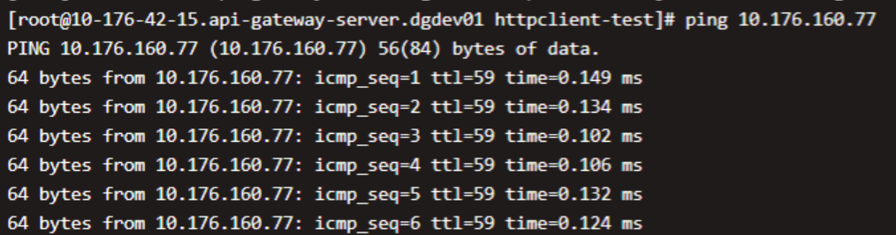

# ESA RestClient


[](https://codecov.io/gh/esastack/esa-restclient)
[](https://maven-badges.herokuapp.com/maven-central/io.esastack/restclient/)
[](https://github.com/esastack/esa-restclient/blob/main/LICENSE)

ESA RestClient is an asynchronous event-driven http client based on netty.

## Features

- Http1/H2/H2cUpgrade
- Https
- Epoll/NIO
- Serialize and Deserialize
- Interceptor
- Filter
- Retry, Redirect, 100-expect-continue
- Segmented read/write
- Multipart
- Metrics
- more features...

## Maven Dependency
> **Note：`netty` 4.1.52.Final and `tcnative` 2.0.34.Final are directly dependent on.**

> **Note: Please make sure the version of `tcnative` matches the version of `netty`.**

```xml
<dependency>
    <groupId>io.esastack</groupId>
    <artifactId>restclient</artifactId>
    <version>${esa-restclient.version}</version>
</dependency>
```

## Quick Start

```java
final RestClient client = RestClient.ofDefault();

final String entity = client.post("http://127.0.0.1:8081/")
                        .maxRetries(3)     //设置重试次数
                        .readTimeout(3000)      //读超时
                        .entity("Hello Server")
                        .execute()
                        .toCompletableFuture()
                        .get()
                        .bodyToEntity(String.class);
```

## Performance

### Test cases

- We built an echo server by ESA-HTTPServer and used ESA-RestClient(1.0.0)、ESA-HttpClient(1.0.0) to do the requests for RPS testing with fixed string:'OK' and different ratio of asynchronous to synchronous requests.This is because if all requests are executed asynchronously, many requests are requesting to obtain connections, resulting in errors. Therefore, the test method is to use asynchronous and synchronous alternately to make requests, so as to achieve the best performance.
- Also we used `Apache HttpComponents`(5.1.2) and `OK-HttpClient`(4.9.2) to build a client which is same with above for RPS testing.

### Hardware Used

We used the following software for the testing:

  |        | OS                       | CPU  | Mem(G) |
  | ------ | ------------------------ | ---- | ------ |
  | client | CentOS Linux release 7.6.1810(docker) | 4    | 8      |
  | server | CentOS Linux release 7.6.1810(docker) | 8    | 16     |
  

### JVM Options

```
-Xms1024m -Xmx1024m -XX:MetaspaceSize=128m -XX:MaxMetaspaceSize=256m -XX:+UseConcMarkSweepGC -XX:+UseCMSInitiatingOccupancyOnly -XX:CMSInitiatingOccupancyFraction=70
```
### Ping Result


### Client Options

| Framework  | Options                                                      |
| ---------- | ------------------------------------------------------------ |
| ESA-HttpClient  | System.setProperty("io.esastack.httpclient.ioThreads", "4");<br>HttpClient.create()<br>&emsp;&emsp;.connectTimeout(1000)<br>&emsp;&emsp;.readTimeout(3000)<br>&emsp;&emsp;.connectionPoolSize(connectionPoolSize)<br>&emsp;&emsp;.connectionPoolWaitingQueueLength(512).build(); |
| ESA-RestClient | System.setProperty("io.esastack.httpclient.ioThreads", "4");<br>RestClient.create()<br>&emsp;&emsp;.connectTimeout(1000)<br>&emsp;&emsp;.readTimeout(3000)<br>&emsp;&emsp;.connectionPoolSize(connectionPoolSize)<br>&emsp;&emsp;.connectionPoolWaitingQueueLength(512).build(); |
| Apache HttpComponents | PoolingAsyncClientConnectionManager connectionManager = PoolingAsyncClientConnectionManagerBuilder.create()<br>&emsp;&emsp;.setMaxConnTotal(connectionPoolSize)<br>&emsp;&emsp;.setConnectionTimeToLive(TimeValue.ofMinutes(1L))<br>&emsp;&emsp;.build();<br><br>IOReactorConfig ioReactorConfig =IOReactorConfig.custom()<br>&emsp;&emsp;.setIoThreadCount(4)<br>&emsp;&emsp;.build();<br><br>client = HttpAsyncClients.custom()<br>&emsp;&emsp;.setConnectionManager(connectionManager)<br>&emsp;&emsp;.setIOReactorConfig(ioReactorConfig)<br> &emsp;&emsp;.setDefaultRequestConfig(RequestConfig.custom()<br>&emsp;&emsp;&emsp;&emsp;.setConnectTimeout(Timeout.ofSeconds(1))<br>&emsp;&emsp;&emsp;&emsp;.setResponseTimeout(Timeout.ofSeconds(3))<br>&emsp;&emsp;&emsp;&emsp;.build())<br>&emsp;&emsp;.build(); |
| OK-HttpClient | client = new OkHttpClient.Builder()<br>&emsp;&emsp;.connectTimeout(1, TimeUnit.SECONDS)<br>&emsp;&emsp;.readTimeout(3, TimeUnit.SECONDS)<br>&emsp;&emsp;.build();<br><br>client.dispatcher().setMaxRequests(maxRequest);<br>client.dispatcher().setMaxRequestsPerHost(maxRequest); |


### Best RPS

|                | ESA-HttpClient       | ESA-RestClient      | Apache HttpComponents      | OK-HttpClient       | 
| -------------- | --------- | --------- | --------- | --------- | 
| Best RPS | 116013.75 | 111217.98 | 89633.73 | 70501.59 | 
| ratio of async to sync | 800 | 800 | 50 | 300 | 
| num of io threads  | 4 | 4 | 4 | 10(MaxRequestsPerHost) | 
| num of biz threads  | 1 | 1 | 10 | 1 | 


See more details in [Reference Doc](https://www.esastack.io/esa-restclient)
