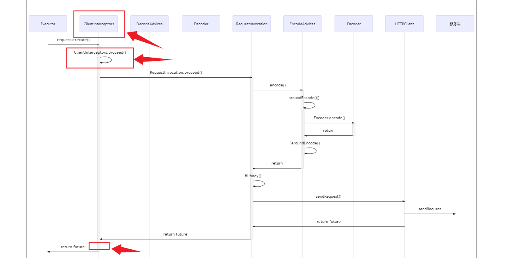

# 编解码
`RestClient`支持通过builder配置和SPI加载两种方式配置`ClientInterceptor`。

## Builder配置

在构造`RestClient`时传入自定义的`ClientInterceptor`实例，如：
```java
final RestClient client = RestClient.create()
                                .addInterceptor((request, next) -> {
                                     System.out.println("Interceptor");
                                     return next.proceed(request);
                                 }).build();
```

## SPI

`RestClient`支持通过Spi的方式加载`ClientInterceptor`接口的实现类，使用时只需要按照SPI的加载规则将自定义的`ClientInterceptor`放入指定的目录下即可。

```tip
- 多个拦截器之间通过`getOrder()`方法返回值区分执行顺序，值越小，优先级越高。
```

## 执行时机
